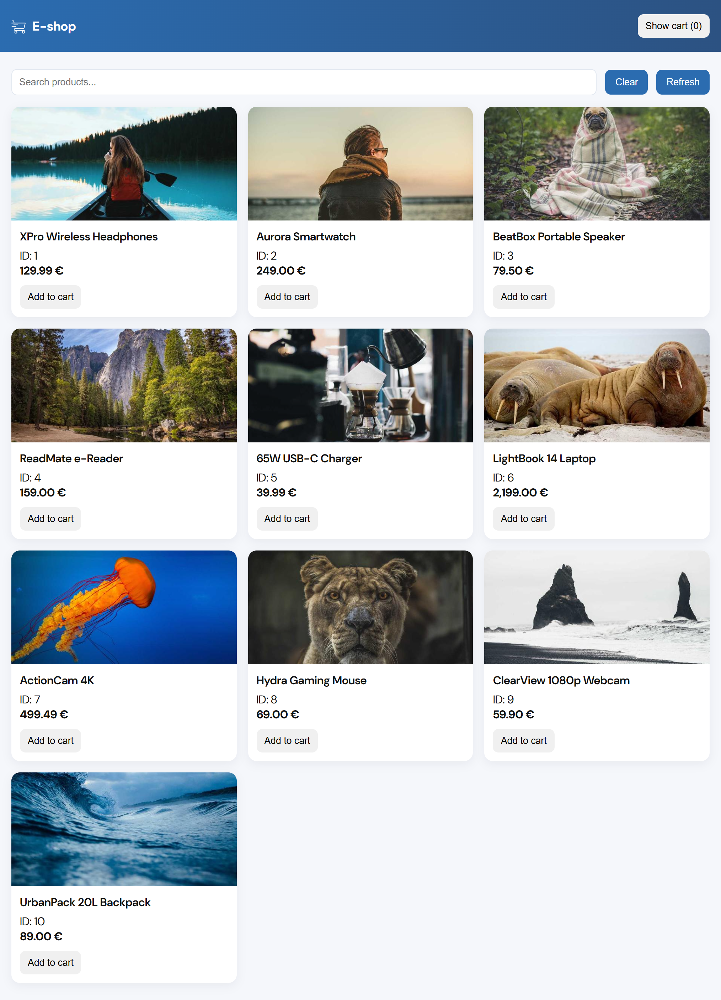

# eShop

A simple e-commerce website built with **HTML, CSS, and JavaScript**, using a JSON file as a lightweight database.  
The main feature is a **shopping cart implemented with a modal window**, providing a smooth user experience.

## 🌐 Live Demo
[View Website](https://my-o-o.github.io/eShop/)

## ✨ Features
- Responsive design for desktop and mobile.
- **Shopping cart** with modal window functionality.
- Clean structure with separate files: `index.html`, `styles.css`, `script.js`.

## 📸 Preview

